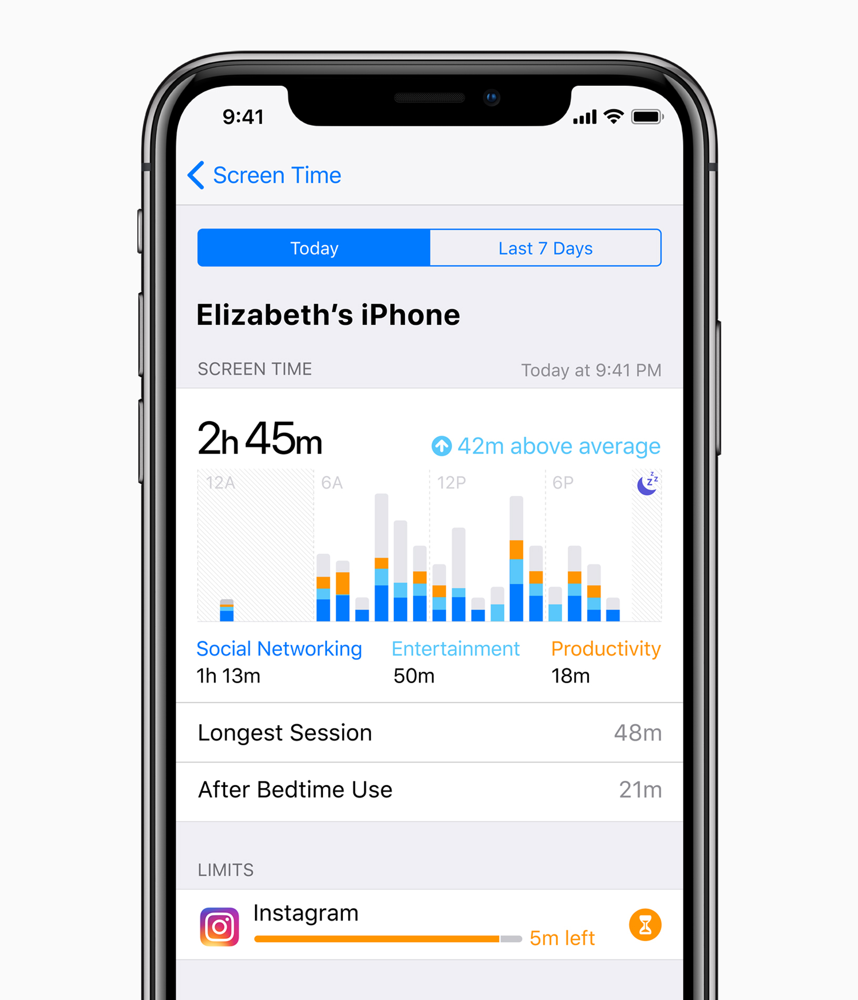

# aw-import-screentime

Track your screen usage of your iPhone or iPad in [ActivityWatch](https://activitywatch.net) by continuously importing Apple's [Screen Time](https://support.apple.com/en-us/108806) App.InFocus telemetry into ActivityWatch buckets. Run `aw-import-screentime watch` to stream new focus events as they land on disk; use the other commands when you need previews, backfills, or raw inspection.



## What you get

- A real-time watcher that stitches new App.InFocus events, enriches them, and pushes them straight into ActivityWatch with per-device buckets.
- Automatic watermark persistence and retry handling so transient ActivityWatch outages do not drop data.
- On-demand previews and imports for ad-hoc investigations or backfills.
- Device discovery straight from `~/Library/Biome/sync/sync.db`.
- Raw protobuf inspection tools for debugging Screen Time data.

## Requirements

- Enable "Share Across Devices" on both the iOS and macOS device.
- macOS with Screen Time enabled (the tool reads from `~/Library/Biome/streams/restricted/App.InFocus/remote/…`).
- Full Disk Access for the terminal/IDE you use to run the CLI.
- Python 3.10–3.13 and [uv](https://docs.astral.sh/uv).
- An ActivityWatch server (default port 5600, testing port 5666).

## Installation

```bash
git clone https://github.com/ActivityWatch/aw-import-screentime.git
cd aw-import-screentime
uv sync
source .venv/bin/activate
aw-import-screentime --help

```

`uv sync` also installs `ccl-segb` from [GitHub](https://github.com/cclgroupltd/ccl-segb), which is required to parse the binary `SEGB` stream Apple stores on disk.

## Quick start

```bash
# Stream live Screen Time focus events into ActivityWatch
aw-import-screentime watch --testing
```

This launches the long-running watcher: it discovers your devices, keeps per-device watermarks, retries inserts if aw-server is briefly offline, and enriches events with App Store titles. Drop `--testing` to talk to a production server, and consider supervising the command with launchd, systemd, or a tmux session for continuous ingestion.

## Screen Time data locations

Apple stores the data this tool consumes under `~/Library/Biome`. The importer reads:

- `~/Library/Biome/sync/sync.db` (device metadata)
- `~/Library/Biome/streams/restricted/App.InFocus/remote/<device_id>/*`

## CLI overview

```bash
Usage: aw-import-screentime [OPTIONS] COMMAND [ARGS]...

Initialize logging and shared context.

Options:
  --log-level        TEXT  ERROR | WARNING | INFO | DEBUG
  --tz               TEXT  Timestamp timezone (local or utc)
  --config           PATH  Path to aw-import-screentime TOML config file
  --version
  --help                   Show this message and exit.

Commands:
  config    Manage aw-import-screentime TOML configuration.
  devices   List available DevicePeer identifiers (optionally with stream-dir paths).
  file      Inspect a single SEGB file (raw protobufs or stitched intervals).
  watch     Purely event-driven watcher: - Uses watchdog to wake on SEGB file changes (create/modify/move). - On each wake, decodes only *new* protobufs (cf watermark per device). - Stitches them into historical ActivityWatch interval events with true timestamps. - Inserts events via insert_events (no heartbeats).
  events
```

`watch` is the primary command and streams progress via Rich logging; the supporting commands emit JSON so you can pipe their output into `jq` or other tooling. The `--since` option (on `events` subcommands and `file`) accepts ISO-8601 timestamps or natural language such as `24h`, `7d`, `now-15m`, `yesterday`, or `today`.

By default, configuration is loaded from:

- `~/Library/Application Support/activitywatch/aw-import-screentime/aw-import-screentime.toml`

CLI flags override TOML values when both are provided.

### `config`

Create, inspect, and validate watcher config:

```bash
# Create starter config
aw-import-screentime config init

# Show parsed config + effective defaults
aw-import-screentime config show

# Validate syntax and values
aw-import-screentime config validate
```

### `watch` (primary)

Continuously watch Biome for new SEGB files, stitch them into ActivityWatch intervals, and push them to per-device buckets in real time. Run this command under a supervisor to keep ActivityWatch in sync.

```bash
aw-import-screentime watch --device ABCDEF0123456789
```

- `--device / -d` filters the devices being watched (omit to include all).
- `--storefront` mirrors the events commands for title enrichment locales.
- `--testing/--no-testing` and `--port` control which ActivityWatch server receives events.
- Maintains per-device watermarks and automatically retries failed inserts after a short delay.
- If omitted, these options can come from `aw-import-screentime.toml`.

### `events`

The `events` group provides read-only previews and ActivityWatch imports that share a common set of filters:

- `--device / -d` limits processing to specific device identifiers.
- `--platform` selects the DevicePeer platform (`2` = iOS).
- `--limit / -n` controls how many files per device are scanned (`0` = all).
- `--since` clips stitched intervals to recent activity.
- `--storefront` supplies App Store locales for title enrichment (defaults to `["us"]`).

#### `events preview`

Dry-run the stitching pipeline without contacting ActivityWatch.

```bash
aw-import-screentime events preview --device ABCDEF0123456789 --limit 10 --since 24h --storefront us --storefront se | jq .
```

#### `events import`

Run the same decoding logic, but stream the events into ActivityWatch. A bucket named `aw-import-screentime_ios_ios-<device_id>` is created per device (append `--bucket-suffix` for experiments).

```bash
# Import the last 24h from every device into an ActivityWatch test server on port 5600
aw-import-screentime events import --since 24h --limit 20
```

- `--bucket-suffix` appends a suffix to each bucket name.
- `--testing` switches the ActivityWatch client into testing mode (port `5666`).
- `--port` explicitly overrides the ActivityWatch port.

### `file`

Inspect a single SEGB file either as raw protobuf entries or stitched intervals.

```bash
# Stitched summary (default)
aw-import-screentime file ~/Library/Biome/streams/restricted/App.InFocus/remote/00000000-0000-0000-0000-000000000000/00012345 --max-events 10 | jq .

# Raw protobuf dump
aw-import-screentime file ... --raw --raw-limit 5 | jq .
```

- `--raw/--stitched` toggles the output mode.
- `--raw-limit` caps how many protobuf entries are decoded.
- `--max-events` limits how many stitched events are included in the JSON payload (set to `0` for everything).
- `--since` and `--storefront` behave like the `events` commands.

### `devices`

List DevicePeer identifiers discovered in `sync.db`.

```bash
aw-import-screentime devices --paths | jq .
```

- `--platform` lets you query a different Apple platform (default `2`, which is iOS).
- `--paths` includes the resolved stream directory for each device.

## Testing with ActivityWatch port 5666

ActivityWatch exposes a dedicated testing port (5666) when you launch `aw-server --testing`. Use one of the following when experimenting against that instance:

- `--testing` switches the `ActivityWatchClient` into testing mode (port `5666`). Use this whenever you are talking to `aw-server --testing`.
- `--port 5666` achieves the same override if you prefer to specify it explicitly.

Both options keep the production data on port 5600 untouched while you verify the importer.

## Limitations

- Only the App.InFocus stream is decoded today; other Screen Time streams (notifications, website usage, etc.) are ignored.
- If Biome has not synced yet, the CLI simply reports empty devices.
- macOS sometimes logs incomplete foreground durations; intervals are stitched best-effort and may be shorter than what you see in Screen Time.app.
- App title enrichment depends on live App Store lookups and therefore needs network access the first time a bundle is seen.
- The watcher retries failed uploads with a 5-second back-off. Persistent failures will keep retrying; check the logs to investigate connectivity issues.

## Troubleshooting

- **The Biome folders are empty.** Unlock Screen Time, enable “Share Across Devices” on both macOS and iOS, then give iCloud a few minutes to sync. You can verify files are present with `ls ~/Library/Biome/streams/restricted/App.InFocus/remote`.
- **Permission denied when reading Biome.** Confirm your shell or IDE already has Full Disk Access (System Settings → Privacy & Security → Full Disk Access). Restart the terminal after granting access.
